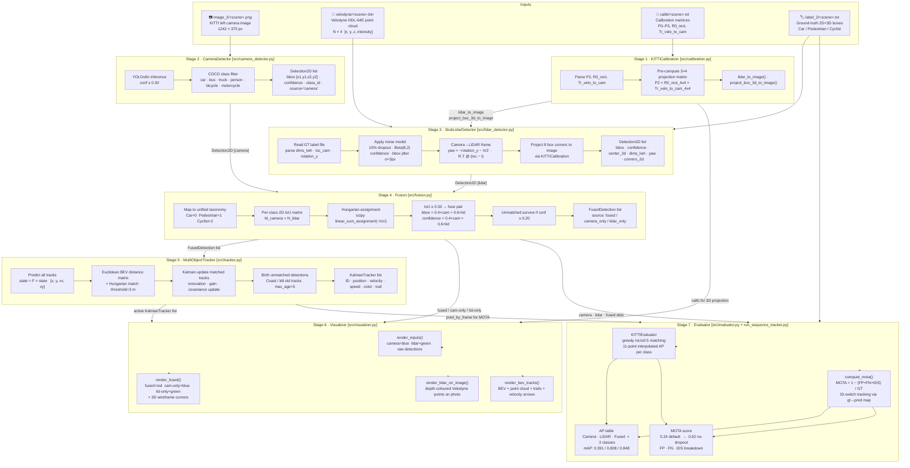

# Pipeline Architecture

End-to-end data flow from raw KITTI files to detection metrics and tracked outputs.

## Key Design Decisions

| Decision | Rationale |
|---|---|
| **Late fusion** (detection-level) | Each sensor's detector runs independently — swap any detector without touching fusion or evaluation code |
| **Class-aware IoU matching** | Prevents a camera pedestrian matching a LiDAR car even when boxes overlap |
| **LiDAR confidence weighted 0.6 vs camera 0.4** | LiDAR gives metric-accurate 3D geometry; camera gives semantic richness |
| **Kalman state [x, y, vx, vy]** | Constant-velocity model is sufficient at 10 Hz; higher-order models overfit noise |
| **Stub detector with GT + noise** | Validates fusion and tracking math without a GPU-dependent PointPillars model |
| **Camera-only dets included in MOTA pred** | Tracker skips camera-only (no center_3d); including them in pred avoids phantom FN |
